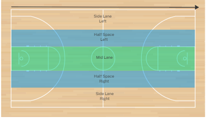
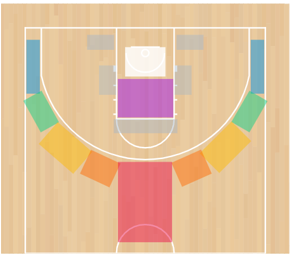

# Big 5 Pillars

## 1. ROLE of the COACH

* Philosophy 
   * Shared Vision
   * Teach + Demand
       * Best Effort
       * Attention Focus
   * Each one… Teach one
       * Player coach Bond
   * Parents
       * Educate them – road map – codex – journey ahead
   * Coaching Behaviour
       * “Passion, not misguided emotion”
* Zie ook Cursussen Basket Vlaanderen ABC (Autonomie – Binding – Competentie)
 
## 2. DEFENCE

* Ownership 1v1 D (No straight line drives)
    * Guard your yard!
* Great Defence transition ( TnT = Tagging and Transition)
    * React + Sprint
    * Point + Talk (stop ball)
    * Wall-Up Princip
    * Take Space Away
* Great Team Rebounding
    * Tag + Pursue
    * End of drill emphasis
* Communication in Defense, vocabulary to agree upon later

## 3. OFFENCE (Gap Attack + Race to Space))

* Pace (Race to Space)
    * Pitch Ahead
    * Ball push!
    * Bolts!
* Spacing (Gap Attack: 5 lanes – 16 Areas, see next slide)
    * Lanes & Spots
    * 4 out 1 in? 5 Out?
* Ball Share (Paint Touches and ball reversals)
    * Pen-kick-swing
    * Swing-swing
    * Getting open
* Read-React-Attack (Wheel action, see Noah Laroche - https://www.youtube.com/watch?v=1e7U4-PrIBE&t=21s)
* Shot selections (Only ROB Shots)
    * Late time offensive rebouding!

## 4. Athletic Development (Activation => neuro musculair)

* Sport Specific
    * Skipping
    * Agility/Footwork
    * Reactionary – Partner Contest
* Conditioning stations
    * Combo drill based
* Additionally: Grease the Groove (repeat to repeat instead of repeat to failure)  – Brainkinetics – Max Speed

 ## 5. CONNECTING

* CLA (as much as possible except for the first learning)
* Keep Score

Important! Keep the following in mind: TLC / ABC²
Teaching – learning – competition (in het Nederlands aanleren, beheersen, competitief). As a coach do not skip, it takes time and a lot of repitions to learn a new skill)

 ### The Race to Space lanes

 

 The 5 lanes South-North:
 - Side Lane => Keep spacing
 - Half Space => Lane for ball handler
 - Mid Lane => Lane for trainers (Second Trailer - Rim Run - optional)

 ### The Main Windows or Areas

 Spacing is key!

 A window (or area or spot) is an area in which a player can move to create a passing lane (no 3 players in a row principle).

 Perimeter windows are always outside 3 point line.

 Always try to attach the white area (smile, low box, ...)

 If white area is crowded, the preferably stride stop in decission area. Decissions: Shoot or pass.

 Grey Areas to be used if playing 4 out one in (preferred area is Short Corner)

 Blue => Corner window
 Green => Side window
 Yellow => 45 window
 Orange => Slot window
 Red => High window
 White => The Smile = The Low Box = The 6th Spot
 Grey => Possible windows in 4 out 1 in
 Purple => The High Box (decission area)
